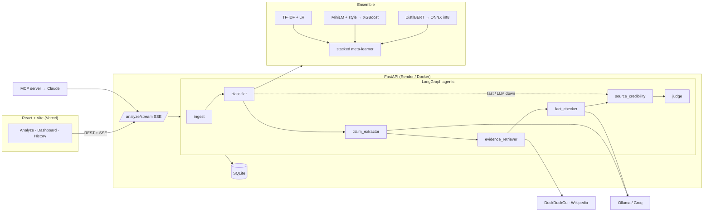

# VeriFact — Agentic Fake News Detection

> **Deep-learning ensemble + LLM fact-checking agents + live web evidence**, served as a
> streaming API with a React dashboard and an MCP server. Trained on **LIAR** and **FakeNewsNet**.

**Live demo:** https://verifact-phi.vercel.app · **API docs:** `/docs` on the backend · [Architecture](docs/ARCHITECTURE.md)

    

---

## Why it's different

Most "fake news detectors" are a single text classifier that learned the *style* of a dataset.
VeriFact separates the three questions that actually matter and answers each with the right tool:

| Question | Who answers it | How fast |
|---|---|---|
| Does it **read** like misinformation? | 3-model deep-learning ensemble (TF-IDF+LR · MiniLM+XGBoost · fine-tuned DistilBERT→ONNX int8) with a stacked meta-learner | ~50 ms |
| Is what it **says** true? | LLM agents: claim extraction → DuckDuckGo + Wikipedia evidence → fact-check with stances | 10–30 s |
| **Who** is saying it? | Source-credibility agent: curated lists + FakeNewsNet domain stats + look-alike/TLD heuristics | instant |

A deterministic **judge** fuses all signals in logit space into one verdict with a calibrated
confidence, and every agent's work is streamed live to the UI and recorded for audit.

## Features

- 🧠 **Ensemble of 3 models** trained on 34.5k labelled items from LIAR + FakeNewsNet, stacked on out-of-sample predictions; all metrics on a held-out test set (`models/metrics.json`, Dashboard page).
- 🤖 **LangGraph multi-agent pipeline** — ingest · classifier · claim extractor · evidence retriever · fact checker · source credibility · judge. Per-agent tracing, failure containment, automatic routing around a downed LLM.
- 🔍 **Explainability** — signed token attributions, stylistic red flags, per-claim evidence with stances, LLM reasoning, fusion notes.
- ⚡ **Streaming API** — Server-Sent Events over POST so users watch the agents work.
- 🌐 **URL or text input** — SSRF-guarded article extraction with trafilatura.
- 🔌 **MCP server** — use VeriFact as a tool from Claude Desktop / Claude Code.
- 🔁 **Feedback loop** — users rate verdicts; agreement is tracked on the dashboard.
- 🏗️ **Provider-agnostic LLM** — Ollama locally (`llama3.2`), Groq free tier in the cloud, any OpenAI-compatible endpoint.
- 🚀 **One-click deploy** — Docker + `render.yaml` for the API, Vercel for the SPA.

## Architecture



## Results (held-out test, 3,453 items across LIAR / PolitiFact / GossipCop)

| Model | Accuracy | F1 (fake) | ROC-AUC |
|---|---|---|---|
| TF-IDF + Logistic Regression | 0.724 | 0.584 | 0.785 |
| MiniLM embeddings + style → XGBoost | 0.741 | 0.592 | 0.791 |
| DistilBERT (fine-tuned) | _training — see Dashboard_ | | |
| **Stacked ensemble (TF-IDF + MiniLM)** | **0.757** | 0.576 | **0.812** |

Per-dataset (ensemble): GossipCop 0.842 · PolitiFact 0.707 · LIAR 0.622 accuracy. Full breakdown, confusion matrix and calibration: 📓 [notebooks/02_model_training_and_evaluation.ipynb](notebooks/02_model_training_and_evaluation.ipynb), `GET /metrics/models`, or the Dashboard.
LIAR is a famously hard benchmark (binary SOTA ≈ 0.70); GossipCop headlines are easier (~0.85).

## Datasets

| | Source | Items | Labels |
|---|---|---|---|
| **LIAR** | Wang, W. Y. (2017). *"Liar, Liar Pants on Fire": A New Benchmark Dataset for Fake News Detection.* ACL. | 12,810 PolitiFact statements | 6-way, binarised |
| **FakeNewsNet** | Shu, K. et al. (2018). *FakeNewsNet: A Data Repository with News Content, Social Context and Spatiotemporal Information.* | 983 PolitiFact + 20,741 GossipCop headlines with source URLs | fake / real |

`python scripts/download_data.py` fetches both from their public mirrors.

📓 **[notebooks/01_data_preprocessing.ipynb](notebooks/01_data_preprocessing.ipynb)** — executed walkthrough of loading, cleaning, label binarisation, de-duplication, splits, class balance, text-length and stylistic-feature EDA, and leakage checks.

## Project structure

```
backend/
  api/        main.py (FastAPI + SSE), schemas.py
  agents/     graph.py (LangGraph pipeline + judge fusion)
  ml/         data.py · features.py · train.py · predictor.py
  services/   llm.py · evidence.py · ingest.py · credibility.py · store.py
  core/       config.py
frontend/     React + Vite + TS (Vercel)
mcp_server/   server.py (FastMCP tools)
scripts/      download_data.py · export_*_onnx.py · build_preprocessing_notebook.py
notebooks/    01_data_preprocessing.ipynb (executed EDA + preprocessing)
models/       trained artefacts + metrics.json (int8 ONNX transformer ≈ 65 MB)
tests/        pytest (unit + API)
docs/         ARCHITECTURE.md
```

## Run locally

```bash
# 1. backend
pip install -r requirements.txt
python scripts/download_data.py
python -m backend.ml.train all          # ~25 min on CPU; or skip — trained artefacts are in models/
uvicorn backend.api.main:app --reload   # http://127.0.0.1:8000/docs

# 2. LLM for deep mode (pick one)
ollama pull llama3.2                    # local, default
# or: export LLM_PROVIDER=groq GROQ_API_KEY=...   (free key at console.groq.com)

# 3. frontend
cd frontend && npm install && npm run dev   # http://localhost:5173
```

```bash
pytest -q         # tests
```

## API

| Method | Path | Purpose |
|---|---|---|
| `POST` | `/analyze` | `{text|url, mode: fast|deep}` → full result |
| `POST` | `/analyze/stream` | same, as SSE `step…` events then `result` |
| `POST` | `/analyze/batch` | ML-only scoring for many texts |
| `GET` | `/analysis/{id}` · `/history` | stored results |
| `POST` | `/feedback` | `{analysis_id, rating}` |
| `GET` | `/metrics/models` · `/metrics/usage` | evaluation + usage stats |
| `GET` | `/health` · `/examples` | status, demo inputs |

## MCP server (use from Claude)

```bash
pip install "mcp[cli]"
claude mcp add verifact -e VERIFACT_API_URL=http://127.0.0.1:8000 -- python -m mcp_server.server
```
Tools: `check_news(text|url, mode)`, `score_headlines([...])`, `model_metrics()`, `recent_analyses()`.

## Deploy

**API → Render:** New → Blueprint → this repo (`render.yaml`, Docker runtime). Set `GROQ_API_KEY`.
**Frontend → Vercel:** import repo, root directory `frontend`, env `VITE_API_URL=https://<api>.onrender.com`.

## License

MIT
